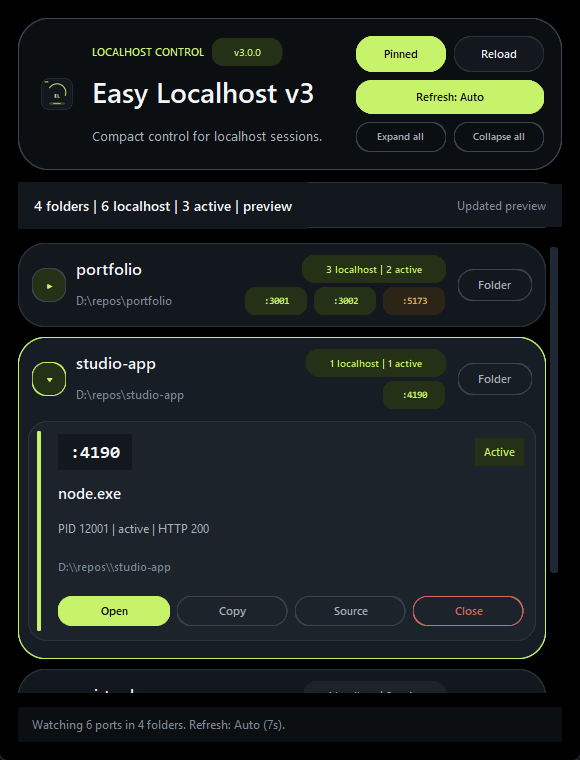

# Easy Localhost v3

Easy Localhost v3 is a compact Windows desktop controller for local development servers. It keeps a live view of the localhost ports you actually care about, groups them by project folder, shows which ones are healthy, and lets you act on them without dropping to terminal commands.

The v3 refresh introduces a darker graphite UI, a cleaner monogram icon, compact collapsible folder summaries, a single-cycle refresh control, and a more consistent portable Windows build with executable version metadata.



## What It Solves

When you work with multiple repos, AI coding tools, IIS Express, `npm run dev`, `dotnet`, Python dev servers, or several versions of the same app, localhost becomes noisy fast. It is common to end up with many listening ports and very little context about:

- which port belongs to which project
- whether the port is responding over HTTP
- where the process came from
- how to open it quickly
- how to close it cleanly

Easy Localhost keeps that focused in a small always-on-top panel built only for localhost process control.

## Features

- Live localhost monitoring with low overhead
- Compact floating Windows UI designed to stay visible in a screen corner
- Graphite and lime visual system with pure black background and sharper hierarchy
- Shared monogram `EL` app icon embedded in the UI, executable, and release assets
- Collapsible grouping by project or folder with compact summary rows
- Clickable group headers to expand or collapse folders quickly
- Up to three visible port chips on collapsed folders for fast scanning
- Stable scroll behavior during refreshes
- Manual reload plus a single refresh button that cycles through `Auto`, `10s`, `5s`, and `Manual`
- Automatic project detection from Git roots, `package.json`, and common project markers
- HTTP health probing to distinguish active servers from plain listeners
- One-click actions per entry:
  - `Open` in Chrome when available
  - `Copy` localhost URL
  - `Source` open the project folder in Explorer
  - `Close` terminate the owning process tree
- Portable `EasyLocalhost.exe` build with Windows version metadata
- No backend service
- No installation required for the built app
- No external network calls
- No file edits inside your projects

## Safety Model

This repository is intentionally narrow in scope.

- It reads only local process and socket metadata from Windows.
- It inspects only local folders to infer project names.
- It never modifies source code in detected projects.
- It never connects to external hosts.
- It does not collect telemetry.
- It does not store secrets, tokens, or credentials.
- It does not commit or require machine-specific absolute paths.
- It does not require admin rights unless you try to close a process that Windows protects.

## Stack

- Python
- `customtkinter` for the desktop UI
- `psutil` for socket and process inspection
- `PyInstaller` for a portable `EasyLocalhost.exe`

## Run In Development

```powershell
python -m pip install -r requirements.txt
python src\main.py
```

## Build The Portable EXE

```powershell
.\build.ps1
```

The generated binary is:

```text
dist\EasyLocalhost.exe
```

## Windows SmartScreen

The portable EXE is unsigned. Microsoft SmartScreen can still warn for a new unsigned application, even when the code is clean. That warning cannot be honestly eliminated from code alone.

What v3 does improve:

- consistent executable icon
- Windows version metadata
- public SHA256 hash in each release
- reproducible public build inputs in the repo

To eliminate SmartScreen warnings consistently, you need a trusted code-signing certificate or an external signing service.

For verification, compare the SHA256 hash published in each GitHub Release with the downloaded file:

```powershell
Get-FileHash .\EasyLocalhost.exe -Algorithm SHA256
```

## Tests

```powershell
python -m unittest discover -s tests -v
```

## Security Checks

```powershell
python -m pip install -r requirements-dev.txt
python -m bandit -r src -q
python -m pip_audit -r requirements.txt
```

## Project Structure

```text
assets/                  App icon assets
docs/                    Preview images used in docs and releases
src/
  actions.py            Safe user actions for localhost entries
  app.py                Desktop UI
  controller.py         Monitor orchestration
  health_checker.py     HTTP probing
  models.py             Core data models and refresh modes
  presentation_state.py Pure UI-state helpers for grouping and summaries
  project_mapper.py     Project or repository detection
  scanner.py            Port and process discovery
  utils.py              Shared constants and helpers
tests/                  Unit tests for core logic
build.ps1               Local build script
EasyLocalhost.spec      PyInstaller build definition
file_version_info.txt   Windows version resource for the portable EXE
```

## Current Scope

This project is intentionally only a localhost controller.

It is not:

- a reverse proxy
- a local tunnel
- a traffic inspector
- a port scanner for external networks
- a project launcher or orchestrator
- a telemetry collector

## License

This project is licensed under the MIT License. See [LICENSE](LICENSE).
